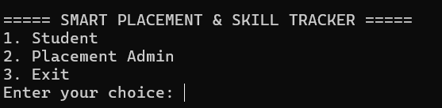
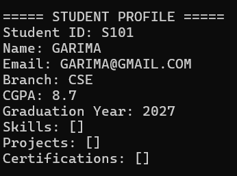
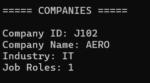
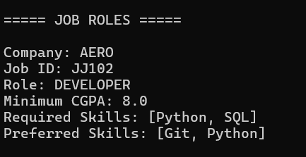
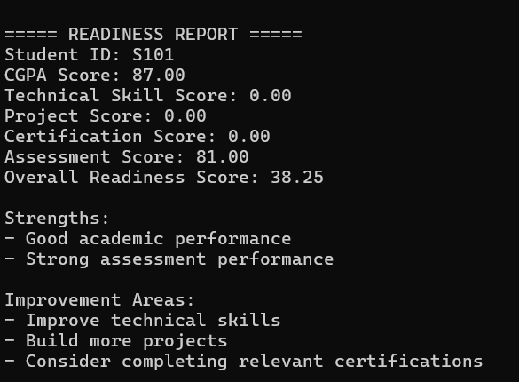
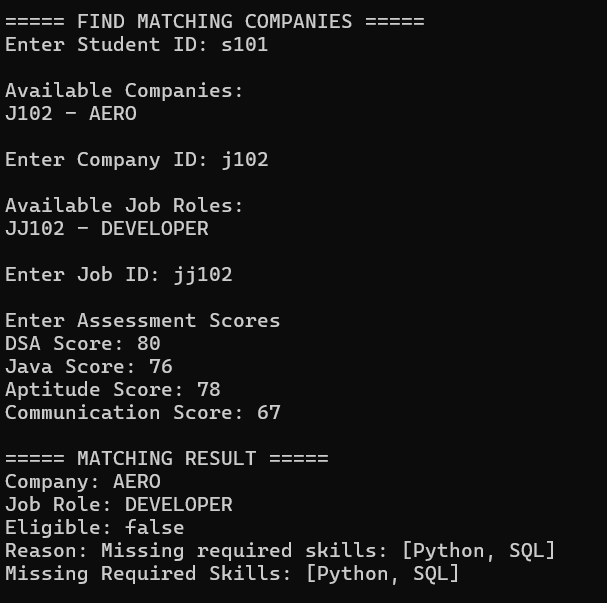
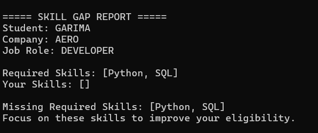
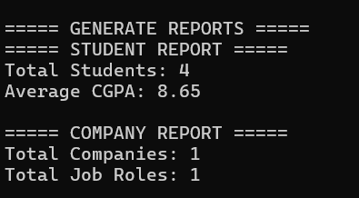

# Smart Placement & Skill Tracker

## 1. Introduction

The Smart Placement & Skill Tracker is a Java-based command-line application designed to help students evaluate their placement readiness and identify suitable job opportunities.

The system allows students to maintain their academic and professional profile, including CGPA, skills, projects and certifications. It also provides placement readiness analysis, company matching and skill gap identification.

Placement administrators can manage student records, companies and job roles and generate placement-related reports.

The application uses object-oriented programming, collections, exception handling, file handling and modular service-based design to provide a structured placement management system.

## 2. Problem Statement

Students often maintain placement-related information such as academic performance, technical skills, projects and certifications separately. This makes it difficult to evaluate their overall placement readiness and understand which job roles match their current profile.

Placement administrators also need to manage student information, companies and job roles in an organized manner.

The proposed system addresses these problems by providing a centralized Java-based application that manages student placement profiles, analyzes readiness, checks eligibility, matches students with suitable job roles and identifies missing required skills.

## 3. Objectives

The main objectives of the Smart Placement & Skill Tracker are:

1. To maintain student academic and placement-related information in one system.
2. To allow students to manage their skills, projects and certifications.
3. To evaluate student placement readiness using multiple profile factors.
4. To check student eligibility for specific job roles.
5. To calculate a matching score between eligible students and job roles.
6. To identify skill gaps by comparing student skills with required job skills.
7. To provide placement administrators with company, job role and student management features.
8. To generate basic placement statistics and reports.
9. To demonstrate practical use of Java programming concepts through a modular application.

## 4. Functional Requirements

### Student Module

- The system shall allow students to create and maintain their profiles.
- The system shall allow students to update their personal and academic information.
- The system shall allow students to add and manage skills with proficiency levels.
- The system shall allow students to add projects and technologies used.
- The system shall allow students to add certifications.
- The system shall calculate placement readiness.
- The system shall find matching companies and job roles.
- The system shall identify missing skills for a selected job role.

### Placement Admin Module

- The system shall allow administrators to view all students.
- The system shall provide student search functionality.
- The system shall allow administrators to add, update and remove companies.
- The system shall allow administrators to manage job roles.
- The system shall display placement statistics.
- The system shall generate student and company reports.

### Eligibility and Matching Module

- The system shall check eligibility based on minimum CGPA and required skills.
- The system shall consider assessment performance when available.
- The system shall calculate a matching score for eligible students.
- The system shall categorize the calculated match score.
- The system shall display skill gaps for students who do not have required skills.

### Data Management

- The system shall save student and company information using file-based storage.
- The system shall load stored data when the application starts.
- The system shall validate user inputs and handle invalid data using exceptions.

## 5. Non-Functional Requirements

### 5.1 Usability
The system should provide a simple command-line interface with clear menus and messages so that students and administrators can use the application easily.

### 5.2 Reliability
The system should validate input data and handle invalid operations without terminating unexpectedly.

### 5.3 Maintainability
The application should use separate packages and classes for models, services, file handling, exceptions and utilities to make the code easier to maintain.

### 5.4 Performance
The system should process student, company and job role information efficiently for the intended placement management workload.

### 5.5 Data Persistence
Student and company information should be stored in files so that the data remains available after the application is closed and restarted.

### 5.6 Portability
The application should run on systems with a compatible Java Development Kit and does not require a web server or database setup.

## 6. System Architecture

The application follows a modular layered architecture.

```text
+--------------------------------------------------+
|                  User Interface                  |
|              Command-Line Interface              |
+--------------------------------------------------+
                       |
                       v
+--------------------------------------------------+
|                  Service Layer                   |
| StudentService | CompanyService | MatchingEngine |
| EligibilityEngine | ReadinessAnalyzer            |
+--------------------------------------------------+
                       |
                       v
+--------------------------------------------------+
|                    Model Layer                   |
| User | Student | Admin | Skill | Project         |
| Company | JobRole | Assessment | Reports         |
+--------------------------------------------------+
                       |
                       v
+--------------------------------------------------+
|              Data & Utility Layer                |
| FileManager | InputValidator | ReportGenerator   |
+--------------------------------------------------+
                       |
                       v
+--------------------------------------------------+
|                 File Storage                     |
|          students.txt | companies.txt            |
+--------------------------------------------------+


## 7. Design Rationale

The project was designed as a modular Java application so that different responsibilities are separated into different classes and packages.

### Object-Oriented Design

Inheritance is used through the `User` superclass and its subclasses `Student` and `Admin`. Encapsulation is implemented using private fields with public methods for controlled access.

### Collections

Different Java collections are used according to the type of data:

- `List` is used for students, projects, certifications, companies and job roles.
- `Set` is used for skills and skill requirements to avoid duplicate entries.

### Service-Based Design

Application logic is separated into service classes such as `StudentService`, `CompanyService`, `MatchingEngine`, `EligibilityEngine` and `ReadinessAnalyzer`.

### Exception Handling

Custom exceptions are used for invalid student and company operations. Input validation prevents invalid values from entering the system.

### File Handling

The `FileManager` class provides file-based persistence for student and company information, allowing data to be loaded when the application starts.

### Separation of Responsibilities

Each class has a specific responsibility, which improves readability, maintainability and future extensibility of the application.


## 8. Implementation

The application is implemented using Java and is organized into multiple packages.

### Model Package

The `model` package contains the main data classes:

- `User`
- `Student`
- `Admin`
- `Skill`
- `Project`
- `Certification`
- `Company`
- `JobRole`
- `Assessment`
- `PlacementResult`
- `ReadinessReport`

### Service Package

The `service` package contains the core business logic:

- `StudentService` manages student records.
- `CompanyService` manages companies and job roles.
- `EligibilityEngine` checks job eligibility.
- `MatchingEngine` calculates matching scores.
- `ReadinessAnalyzer` calculates placement readiness.

### I/O Package

`FileManager` handles saving and loading student and company data using text files.

### Exception Package

Custom exceptions are provided for invalid student, company and eligibility-related operations.

### Utility Package

The `util` package contains:

- `InputValidator` for validating user input.
- `ReportGenerator` for generating placement reports.

### Main Application

`Main.java` provides the command-line interface and connects the different services to the user menus.

The implementation uses Java concepts such as inheritance, encapsulation, collections, enums, exception handling, file handling and modular package organization.


## 9. Screenshots and Results

### 9.1 Main Menu



### 9.2 Student Profile



### 9.3 Company Management



### 9.4 Job Role Management



### 9.5 Placement Readiness



### 9.6 Company Matching



### 9.7 Skill Gap Analysis



### 9.8 Placement Reports



## 10. Testing and Test Results

The application was tested using functional test cases covering student management, company management, validation, eligibility, matching, readiness analysis, file persistence and reporting.

| Test ID | Function Tested | Result |
|--------|------------------|--------|
| TC01 | Create Student Profile | Passed |
| TC02 | Invalid CGPA Validation | Passed |
| TC03 | Duplicate Student ID | Passed |
| TC04 | Update Student Profile | Passed |
| TC05 | Add Company | Passed |
| TC06 | Add Job Role | Passed |
| TC07 | Eligibility Check | Passed |
| TC08 | Skill Gap Detection | Passed |
| TC09 | Company Matching | Passed |
| TC10 | Placement Readiness Analysis | Passed |
| TC11 | File Persistence | Passed |
| TC12 | Report Generation | Passed |
| TC13 | Final Project Compilation | Passed |

All tested core functionalities produced the expected results during testing.


## 11. Challenges Faced

During the development of the Smart Placement & Skill Tracker, several implementation challenges were encountered.

### 11.1 Designing the Matching Logic

A suitable scoring mechanism was required to compare student profiles with job role requirements. The system therefore separates eligibility checking from match-score calculation.

### 11.2 Data Persistence

Since the project uses file-based storage instead of a database, the application required separate save and load operations for student and company information.

### 11.3 Input Validation

Invalid values such as incorrect CGPA, invalid email addresses and duplicate IDs had to be handled properly using validation and custom exceptions.

### 11.4 Managing Multiple Components

The project contains several interconnected models and services. Separating them into packages helped keep the implementation organized and easier to maintain.

### 11.5 Testing

Each major functionality had to be tested individually and then verified again after integrating the different modules.


## 12. Learnings

The project provided practical experience in applying Java programming concepts to a complete application.

The major learnings from the project include:

- Applying object-oriented programming concepts such as inheritance and encapsulation.
- Using Java Collections such as `List` and `Set`.
- Designing modular applications using packages and service classes.
- Implementing custom exception handling and input validation.
- Working with file handling for data persistence.
- Designing eligibility and matching algorithms using multiple factors.
- Performing functional testing of individual modules.
- Using Git and GitHub for version control and project management.
- Understanding how different application components interact in a complete Java project.


## 13. Future Enhancements

The current system can be extended in the future with the following features:

- Integration with a relational database for scalable data storage.
- A graphical or web-based user interface.
- Role-based authentication and secure login.
- More detailed placement analytics and dashboards.
- Additional assessment categories and customizable scoring criteria.
- Advanced company and job recommendation features.
- Export of reports into formats such as PDF or CSV.
- Notifications for new job roles and placement opportunities.


## 14. Conclusion

The Smart Placement & Skill Tracker provides a structured Java-based solution for managing placement-related student information and analyzing placement readiness.

The system combines student profile management, skill tracking, company and job role management, eligibility checking, company matching, skill gap analysis and placement reporting in a single command-line application.

The project demonstrates practical implementation of Java concepts including object-oriented programming, collections, exception handling, file handling, modular package design and application-level business logic.

## 15. References

1. Oracle Java Documentation — Java programming language and standard library concepts.
2. Java Platform, Standard Edition Documentation — Collections, Exception Handling and I/O.
3. Git Documentation — Version control and Git commands.
4. GitHub Documentation — Repository management and version control workflow.
5. VITyarthi Course Project Guidelines — Project requirements and evaluation criteria.